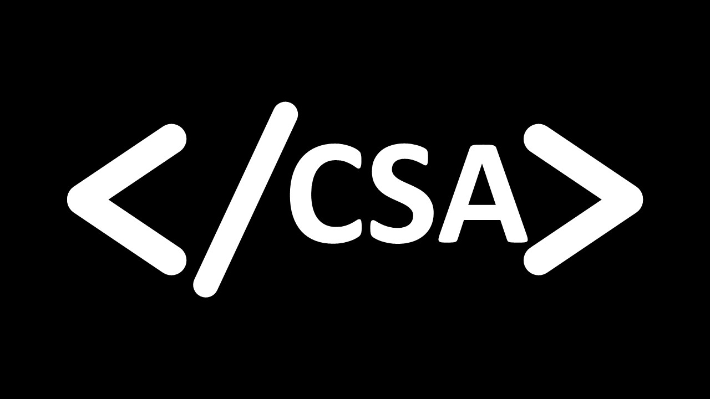

<h1 align="center">Computer Science Association @ HCC</h1>

  

### About Us
The **Computer Science Association (CSA)** at **Houston City College** is dedicated to empowering students to explore, innovate, and lead in the world of technology.  
Our mission is to **train, prepare, and unite students** for the ever-evolving technological frontier, fostering technical excellence, ethical integrity, and professional growth.

---

### What We Do
- Host **workshops** and **tech talks** on emerging technologies.  
- Build **projects** that strengthen programming and teamwork skills.  
- Connect members with **industry professionals** and **career opportunities**.  
- Encourage **research, collaboration, and leadership development**.

---

### Leadership & Membership
CSA welcomes all HCC students with an interest in computer science—whether as a hobby or a career pursuit.  
Leadership positions are open to active members who seek to contribute to the growth and direction of the organization.

---

### Connect With Us
Stay informed about meetings, events, and projects:
- **Email:** [Contact through HCC Student Life or CSA Officers]  
- **Socials:** Follow CSA on official HCC student platforms and social media channels.  
- **Join Us:** Attend a meeting or reach out to an officer to get involved.

---

  

  <b>Computer Science Association @ Houston City College</b> 
  Innovate. Collaborate. Lead.

